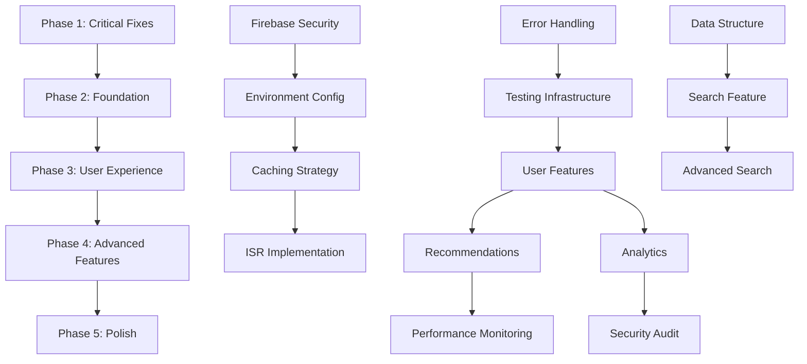

# 🗺️ Net Trailer Implementation Roadmap

## 📊 Executive Summary

**Total Issues Identified**: 46 (16 critical issues + 30 improvements)
**Estimated Total Development Time**: 120-160 hours
**Recommended Team Size**: 2-3 developers
**Project Duration**: 8-12 weeks (part-time) or 4-6 weeks (full-time)

---

## 🎯 Phase-based Implementation Strategy

### 🔥 PHASE 1: Critical Fixes (Week 1-2)
**Goal**: Make project functional and secure
**Time Estimate**: 20-25 hours
**Priority**: P0 - IMMEDIATE

| Issue | Time | Dependencies | Impact | Complexity |
|-------|------|--------------|---------|------------|
| #1 Firebase Config Security | 3h | None | 🔴 Critical | Low |
| #2 API Key Exposure | 2h | Issue #1 | 🔴 Critical | Low |
| #10 Missing Dependencies | 1h | None | 🔴 Critical | Low |
| #6 Environment Configuration | 2h | Issues #1,#2 | 🟠 High | Low |
| #5 Error Handling | 5h | None | 🟠 High | Medium |
| #12 Package.json Issues | 1h | Issue #10 | 🟠 High | Low |
| #13 Version Management | 1h | Issue #12 | 🟠 High | Low |
| #3 Unused Data Fetching | 4h | None | 🟠 High | Medium |
| #4 Data Structure Issues | 3h | Issue #3 | 🟠 High | Medium |

**Phase 1 Success Criteria:**
- [ ] Project builds and runs without errors
- [ ] No exposed secrets or API keys
- [ ] Proper error handling implemented
- [ ] Environment configuration working
- [ ] All unused code removed or utilized

**Phase 1 Deliverables:**
- Working development environment
- Secure configuration system
- Comprehensive error handling
- Clean codebase foundation

---

### 🏗️ PHASE 2: Foundation & Architecture (Week 3-4)
**Goal**: Establish solid technical foundation
**Time Estimate**: 25-30 hours
**Priority**: P1 - HIGH

| Improvement | Time | Dependencies | Impact | ROI |
|-------------|------|--------------|---------|-----|
| Caching Strategy (#1) | 8h | Phase 1 | 🟢 Very High | High |
| ISR Implementation (#2) | 6h | Caching | 🟢 Very High | High |
| Testing Infrastructure (#11) | 6h | Phase 1 | 🔵 High | High |
| Code Splitting (#3) | 4h | Bundle analysis | 🔵 Medium | Medium |
| Enhanced Search (#4) | 10h | API routes | 🟢 Very High | Very High |

**Phase 2 Architecture Decisions:**
```
┌─────────────────┐    ┌─────────────────┐    ┌─────────────────┐
│   Client Layer  │    │  Server Layer   │    │ External APIs   │
│                 │    │                 │    │                 │
│ • React Query   │◄──►│ • Next.js API   │◄──►│ • TMDB API      │
│ • Error Bounds  │    │ • Rate Limiting │    │ • Firebase      │
│ • Code Splitting│    │ • Caching       │    │                 │
└─────────────────┘    └─────────────────┘    └─────────────────┘
```

**Phase 2 Success Criteria:**
- [ ] React Query caching operational
- [ ] ISR generating static pages
- [ ] Comprehensive test coverage (>80%)
- [ ] Search functionality working
- [ ] Code splitting reducing bundle size

---

### 🎨 PHASE 3: User Experience (Week 5-7)
**Goal**: Enhance user engagement and satisfaction
**Time Estimate**: 35-40 hours
**Priority**: P1-P2 - HIGH to MEDIUM

| Improvement | Time | Dependencies | User Impact | Business Value |
|-------------|------|--------------|-------------|----------------|
| Watchlist Feature (#5) | 8h | Phase 2 | 🟢 Very High | Very High |
| TV Shows Support (#13) | 6h | Data structure fix | 🔵 High | High |
| Responsive Design (#9) | 8h | UI audit | 🟢 Very High | High |
| Dark/Light Theme (#10) | 4h | Design system | 🔵 Medium | Medium |
| Enhanced Loading (#11) | 4h | Component library | 🔵 Medium | Medium |
| Modal Experience (#12) | 4h | Navigation system | 🔵 Medium | Medium |
| PWA Implementation (#8) | 8h | Service worker | 🔵 High | High |

**Phase 3 User Journey Map:**
```
Discovery → Search → Browse → Select → Watch → Rate → Save
    ↓        ↓       ↓        ↓       ↓      ↓      ↓
Enhanced   Real-   Responsive Modal   Video  Rating Watchlist
Loading    time    Design    UX      Player System Feature
```

**Phase 3 Success Criteria:**
- [ ] Mobile-responsive across all devices
- [ ] Watchlist functionality complete
- [ ] PWA installable
- [ ] Theme switching working
- [ ] Improved user engagement metrics

---

### 📊 PHASE 4: Advanced Features (Week 8-10)
**Goal**: Differentiate from competitors
**Time Estimate**: 30-35 hours
**Priority**: P2 - MEDIUM

| Improvement | Time | Dependencies | Innovation Level | Market Advantage |
|-------------|------|--------------|------------------|------------------|
| Recommendations (#7) | 8h | User data | 🟢 High | High |
| Advanced Filtering (#15) | 6h | Search system | 🔵 Medium | Medium |
| User Ratings/Reviews (#14) | 8h | Watchlist | 🔵 Medium | High |
| Trailer Queue (#16) | 6h | Video system | 🔵 Medium | Medium |
| Analytics Integration (#21) | 4h | Tracking setup | 🔵 Low | High |

**Phase 4 Data Flow:**
```
User Behavior → Analytics → ML Processing → Personalized Content
     ↓              ↓            ↓               ↓
 Interaction    Tracking     Algorithms    Recommendations
 Patterns       Events       Training      Engine
```

---

### 🔧 PHASE 5: Polish & Optimization (Week 11-12)
**Goal**: Production readiness and performance
**Time Estimate**: 20-25 hours
**Priority**: P2-P3 - MEDIUM to LOW

| Improvement | Time | Dependencies | Business Impact |
|-------------|------|--------------|-----------------|
| Performance Monitoring (#22-23) | 6h | Analytics | Medium |
| Security Enhancements (#24-25) | 8h | Security audit | High |
| Accessibility (#26-27) | 6h | Component audit | Medium |
| CI/CD Pipeline (#28) | 4h | DevOps setup | High |
| Documentation | 6h | Complete system | Medium |

---

## 🎯 Priority Matrix

### Immediate Action Required (Do First)
```
HIGH IMPACT, HIGH URGENCY
┌─────────────────────────┐
│ • Firebase Security #1  │
│ • API Key Exposure #2   │
│ • Missing Dependencies  │
│ • Error Handling #5     │
└─────────────────────────┘
```

### Strategic Projects (Schedule)
```
HIGH IMPACT, LOW URGENCY
┌─────────────────────────┐
│ • Caching Strategy #1   │
│ • Search Feature #4     │
│ • Watchlist Feature #5  │
│ • ISR Implementation    │
└─────────────────────────┘
```

### Quick Wins (Delegate)
```
LOW IMPACT, HIGH URGENCY
┌─────────────────────────┐
│ • Package.json fixes    │
│ • Dead code removal     │
│ • Version management    │
│ • Code formatting       │
└─────────────────────────┘
```

### Future Considerations (Eliminate/Postpone)
```
LOW IMPACT, LOW URGENCY
┌─────────────────────────┐
│ • Advanced analytics    │
│ • Complex animations    │
│ • Non-critical features │
└─────────────────────────┘
```

---

## 📋 Implementation Dependencies Graph



---

## 🚀 Sprint Planning

### Sprint 1 (Week 1): Emergency Fixes
**Sprint Goal**: Make project secure and runnable
**Story Points**: 21

| Task | Story Points | Assignee | Priority |
|------|-------------|----------|----------|
| Fix Firebase config exposure | 5 | Dev 1 | P0 |
| Secure API keys | 3 | Dev 1 | P0 |
| Install missing dependencies | 1 | Dev 2 | P0 |
| Setup environment configuration | 3 | Dev 2 | P0 |
| Implement error handling | 8 | Dev 1 & 2 | P0 |
| Sprint review & planning | 1 | Team | - |

### Sprint 2 (Week 2): Code Quality
**Sprint Goal**: Clean up codebase and establish standards
**Story Points**: 18

| Task | Story Points | Assignee | Priority |
|------|-------------|----------|----------|
| Remove unused code and data | 5 | Dev 1 | P1 |
| Fix data structure inconsistencies | 5 | Dev 2 | P1 |
| Setup testing framework | 5 | Dev 1 | P1 |
| Package.json improvements | 2 | Dev 2 | P1 |
| Sprint review & planning | 1 | Team | - |

### Sprint 3 (Week 3): Performance Foundation
**Sprint Goal**: Establish caching and optimization
**Story Points**: 22

| Task | Story Points | Assignee | Priority |
|------|-------------|----------|----------|
| Implement React Query caching | 8 | Dev 1 | P1 |
| Setup ISR for static generation | 8 | Dev 2 | P1 |
| Code splitting implementation | 5 | Dev 1 | P1 |
| Sprint review & planning | 1 | Team | - |

### Sprint 4 (Week 4): Search & Discovery
**Sprint Goal**: Implement comprehensive search
**Story Points**: 25

| Task | Story Points | Assignee | Priority |
|------|-------------|----------|----------|
| Build search infrastructure | 8 | Dev 1 | P1 |
| Create search UI components | 8 | Dev 2 | P1 |
| Add search suggestions | 5 | Dev 1 | P1 |
| Implement search filters | 3 | Dev 2 | P1 |
| Sprint review & planning | 1 | Team | - |

---

## 📈 Success Metrics & KPIs

### Technical Metrics
| Metric | Current | Target | Measurement |
|--------|---------|--------|-------------|
| Page Load Time | Unknown | <3s | Lighthouse |
| Bundle Size | Unknown | <500KB | Webpack Bundle Analyzer |
| Test Coverage | 0% | >80% | Jest Coverage |
| Security Score | F | A | Security Audit |
| Performance Score | Unknown | >90 | Lighthouse |
| Accessibility Score | Unknown | >95 | Lighthouse |

### User Experience Metrics
| Metric | Current | Target | Measurement |
|--------|---------|--------|-------------|
| Time to First Content | Unknown | <1s | Core Web Vitals |
| Search Response Time | N/A | <300ms | Performance API |
| Error Rate | Unknown | <1% | Error Tracking |
| User Engagement | Unknown | +50% | Analytics |
| Mobile Usability | Unknown | 100% | Mobile Testing |

### Business Metrics
| Metric | Current | Target | Measurement |
|--------|---------|--------|-------------|
| User Retention | Unknown | +30% | Analytics |
| Session Duration | Unknown | +25% | Analytics |
| Feature Adoption | N/A | >60% | Feature Tracking |
| User Satisfaction | Unknown | >4.5/5 | User Feedback |

---

## 🔄 Risk Assessment & Mitigation

### High Risk Items
| Risk | Probability | Impact | Mitigation Strategy |
|------|-------------|--------|-------------------|
| Firebase cost overrun | Medium | High | Implement usage monitoring & limits |
| TMDB API rate limits | High | Medium | Implement aggressive caching |
| Security vulnerabilities | Medium | Critical | Regular security audits |
| Performance degradation | Medium | High | Continuous performance monitoring |

### Technical Debt
| Debt Item | Priority | Effort | Timeline |
|-----------|----------|--------|----------|
| Legacy authentication code | P1 | 8h | Sprint 2 |
| Hardcoded UI values | P2 | 4h | Sprint 3 |
| Missing TypeScript types | P2 | 6h | Sprint 4 |
| Inconsistent naming | P3 | 3h | Sprint 5 |

---

## 🛠️ Development Environment Setup

### Required Tools
```bash
# Essential tools
node >= 18.0.0
pnpm >= 8.0.0
git >= 2.30.0

# Development tools
VSCode + extensions:
  - ES7+ React/Redux/React-Native snippets
  - Prettier - Code formatter
  - ESLint
  - Tailwind CSS IntelliSense
  - TypeScript Hero

# Testing tools
Jest
React Testing Library
Cypress (E2E)
```

### Environment Variables Checklist
```bash
# Firebase (Required)
NEXT_PUBLIC_FIREBASE_API_KEY=
NEXT_PUBLIC_FIREBASE_AUTH_DOMAIN=
NEXT_PUBLIC_FIREBASE_PROJECT_ID=
NEXT_PUBLIC_FIREBASE_STORAGE_BUCKET=
NEXT_PUBLIC_FIREBASE_MESSAGING_SENDER_ID=
NEXT_PUBLIC_FIREBASE_APP_ID=

# TMDB API (Required)
TMDB_API_KEY=

# App Configuration
NEXT_PUBLIC_APP_NAME=
NEXT_PUBLIC_APP_URL=
NODE_ENV=

# Optional Services
NEXT_PUBLIC_GA_ID=
SENTRY_DSN=
VERCEL_URL=
```

---

## 📚 Learning Resources

### For Team Members
| Technology | Resource | Time Investment |
|------------|----------|-----------------|
| Next.js 14 | Official docs + tutorial | 8 hours |
| React Query | TanStack docs + examples | 6 hours |
| TypeScript | Handbook + practice | 12 hours |
| Testing | Jest + RTL documentation | 8 hours |
| Firebase | Getting started guide | 6 hours |

### Architecture Patterns
- **React Query**: Server state management
- **Atomic Design**: Component organization
- **Error Boundaries**: Error handling
- **Custom Hooks**: Logic reuse
- **TypeScript First**: Type safety

---

## 🎉 Definition of Done

### For Each Feature
- [ ] Code written and peer reviewed
- [ ] Unit tests written (>90% coverage)
- [ ] Integration tests passing
- [ ] TypeScript types defined
- [ ] Error handling implemented
- [ ] Responsive design verified
- [ ] Accessibility tested
- [ ] Performance impact measured
- [ ] Security review completed
- [ ] Documentation updated

### For Each Sprint
- [ ] All story points completed
- [ ] Demo prepared and delivered
- [ ] Retrospective conducted
- [ ] Technical debt documented
- [ ] Next sprint planned
- [ ] Metrics updated

### For Each Phase
- [ ] Phase success criteria met
- [ ] Stakeholder sign-off received
- [ ] Performance targets achieved
- [ ] Security audit passed
- [ ] User acceptance testing completed
- [ ] Production deployment successful

---

## 📞 Next Steps & Recommendations

### Immediate Actions (This Week)
1. **Setup Environment**: Create `.env.local` with proper values
2. **Install Dependencies**: Run `pnpm install` to restore packages
3. **Security Audit**: Review and fix exposed credentials
4. **Team Assignment**: Assign developers to Phase 1 tasks

### Week 1 Priorities
1. Fix all P0 critical security issues
2. Establish development environment
3. Create project documentation
4. Setup monitoring and error tracking

### Success Tracking
- Daily standups for Phase 1
- Weekly sprint reviews
- Bi-weekly stakeholder updates
- Monthly performance reviews

### Key Decision Points
- **Week 2**: Choose between full TV show implementation vs. minimal viable
- **Week 4**: Decide on PWA implementation priority
- **Week 6**: Evaluate need for advanced recommendation engine
- **Week 8**: Assess performance optimization requirements

This roadmap provides a comprehensive, prioritized approach to transforming the Net Trailer project from its current state into a production-ready, feature-rich Netflix clone that can serve as an impressive portfolio piece.