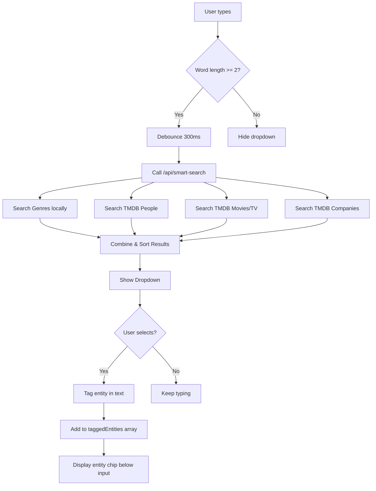

# Smart Row Builder - Complete Flow Document

## 🎯 Core Concept

**One intelligent input field** that understands what users type and offers smart autocomplete for:

- 🎭 **Genres** (Action, Sci-Fi, Horror, etc.)
- 👤 **People** (Actors & Directors with profile photos)
- 🎬 **Movies/TV Shows** (with poster images)
- 🏢 **Studios/Companies** (Warner Bros, Studio Ghibli, Marvel, etc.)
- 💬 **Free-form text** (descriptive words for AI context)

Users can type naturally like: "sci-fi movies with Christopher Nolan" and the system will:

1. Tag "Science Fiction" as a genre
2. Tag "Christopher Nolan" as a director (with his photo)
3. Use the full sentence for AI context

---

## 📱 Complete User Flow

### **Step 1: Smart Input**

```
┌─────────────────────────────────────────────────────────────┐
│ ✨ Create Your Perfect Row                                  │
├─────────────────────────────────────────────────────────────┤
│                                                             │
│ Describe what you want to watch:                           │
│                                                             │
│ ┌─────────────────────────────────────────────────────────┐ │
│ │ I want sci-fi movies with christopher|                  │ │
│ │                                      ↓                  │ │
│ │              ┌─────────────────────────────────┐        │ │
│ │              │ 🎭 Science Fiction (Genre)      │        │ │
│ │              ├─────────────────────────────────┤        │ │
│ │              │ 👤 Christopher Nolan            │        │ │
│ │              │    Director • 156★ popularity   │        │ │
│ │              │    [Photo of Nolan]             │        │ │
│ │              ├─────────────────────────────────┤        │ │
│ │              │ 👤 Christopher Walken           │        │ │
│ │              │    Actor • 89★ popularity       │        │ │
│ │              │    [Photo of Walken]            │        │ │
│ │              ├─────────────────────────────────┤        │ │
│ │              │ 🎬 Christopher Robin (2018)     │        │ │
│ │              │    Movie                        │        │ │
│ │              └─────────────────────────────────┘        │ │
│ │                                                         │ │
│ │ Use ↑/↓ arrows or mouse to select, Enter to confirm    │ │
│ └─────────────────────────────────────────────────────────┘ │
│                                                             │
│ Tips:                                                       │
│ • Type freely - we'll extract entities automatically        │
│ • Tag 2+ items for better AI suggestions                   │
│ • Mix genres, people, movies, and studios                  │
│                                                             │
│ Media Type: ◉ Movies  ○ TV Shows  ○ Both                  │
└─────────────────────────────────────────────────────────────┘
```

**After selecting entities:**

```
┌─────────────────────────────────────────────────────────────┐
│ Your Input:                                                 │
│ "I want @Science Fiction movies with @Christopher Nolan    │
│  and high ratings"                                          │
│         ────────────────              ─────────────────     │
│         [Tagged Genre]                [Tagged Director]     │
│                                                             │
│ Tagged Entities (2):                                        │
│ ┌──────────────────────────────────────────────────────┐    │
│ │ 🎭 Science Fiction                              [×] │    │
│ │    Genre                                             │    │
│ └──────────────────────────────────────────────────────┘    │
│ ┌──────────────────────────────────────────────────────┐    │
│ │ 👤 Christopher Nolan                            [×] │    │
│ │    Director                                          │    │
│ │    [Profile Photo]                                   │    │
│ │    Known for: Inception, Interstellar, Tenet         │    │
│ └──────────────────────────────────────────────────────┘    │
│                                                             │
│ Raw text: "I want sci-fi movies with christopher nolan     │
│            and high ratings"                                │
│                                                             │
│ Media Type: ◉ Movies  ○ TV Shows  ○ Both                  │
│                                                             │
│              [🤖 Generate AI Suggestions →]                 │
└─────────────────────────────────────────────────────────────┘
```

**What happens behind the scenes:**

1. User types "christopher"
2. After 300ms debounce, `/api/smart-search?q=christopher` is called
3. API searches:
    - TMDB People (actors/directors)
    - TMDB Movies
    - TMDB TV Shows
    - TMDB Companies
    - Local Genre list
4. Results sorted by relevance & popularity
5. Dropdown appears with images/icons
6. User selects → Entity gets "tagged" in text and displayed below

---

### **Step 2: AI Analysis & Suggestions**

**Loading State:**

```
┌─────────────────────────────────────────────────────────────┐
│ 🤖 Analyzing Your Preferences...                           │
├─────────────────────────────────────────────────────────────┤
│                                                             │
│              [Animated spinner]                             │
│                                                             │
│         Asking Gemini AI to find patterns...                │
│                                                             │
│ • Analyzing: Science Fiction genre                          │
│ • Analyzing: Christopher Nolan's filmography                │
│ • Detecting common themes and attributes                    │
│ • Generating intelligent suggestions                        │
└─────────────────────────────────────────────────────────────┘
```

**After AI Analysis:**

```
┌─────────────────────────────────────────────────────────────┐
│ 🎯 AI Suggestions                                           │
├─────────────────────────────────────────────────────────────┤
│ Based on: "Science Fiction + Christopher Nolan"            │
│                                                             │
│ 💡 AI Insight: "Nolan is known for mind-bending sci-fi     │
│    thrillers with complex narratives and high production    │
│    values. Users who enjoy his work often appreciate        │
│    thought-provoking plots and stellar cinematography."     │
│                                                             │
│ ━━━━━━━━━━━━━━━━━━━━━━━━━━━━━━━━━━━━━━━━━━━━━━━━━━━━━━━━━━ │
│                                                             │
│ Select filters to define your row:                         │
│                                                             │
│ ✓ [SELECTED - Auto-selected by AI]                         │
│ ┌─────────────────────────────────────────────────────┐     │
│ │ 🎭 Genre: Science Fiction                          │     │
│ │ Your explicit selection                             │     │
│ │ ───────────────────────────────────                 │     │
│ │ Reason: You explicitly tagged this genre            │     │
│ │ Results: ~487 movies available                      │     │
│ │ Confidence: 100%                                    │     │
│ └─────────────────────────────────────────────────────┘     │
│                                                             │
│ ✓ [SELECTED - Auto-selected by AI]                         │
│ ┌─────────────────────────────────────────────────────┐     │
│ │ 🎬 Director: Christopher Nolan                      │     │
│ │ Your explicit selection                             │     │
│ │ ───────────────────────────────────                 │     │
│ │ Reason: You explicitly tagged this director         │     │
│ │ Results: 17 movies available                        │     │
│ │ Confidence: 100%                                    │     │
│ └─────────────────────────────────────────────────────┘     │
│                                                             │
│ ✓ [SELECTED - AI Recommended ⭐ 95%]                       │
│ ┌─────────────────────────────────────────────────────┐     │
│ │ 🎭 Also include: Action, Thriller                   │     │
│ │ [AI Suggested Badge]                                │     │
│ │ ───────────────────────────────────                 │     │
│ │ Reason: 90% of Nolan's sci-fi films combine these  │     │
│ │         genres for intense, action-packed stories   │     │
│ │ Results: Adds +183 more movies                      │     │
│ │ Confidence: 95%                                     │     │
│ └─────────────────────────────────────────────────────┘     │
│                                                             │
│ □ [UNSELECTED - AI Suggested ⭐ 88%]                       │
│ ┌─────────────────────────────────────────────────────┐     │
│ │ ⭐ High Ratings (7.5+)                              │     │
│ │ [AI Suggested Badge]                                │     │
│ │ ───────────────────────────────────                 │     │
│ │ Reason: Nolan's films are critically acclaimed.     │     │
│ │         You mentioned "high ratings" in your input  │     │
│ │ Results: Narrows to ~142 highly-rated titles        │     │
│ │ Confidence: 88%                                     │     │
│ └─────────────────────────────────────────────────────┘     │
│                                                             │
│ □ [UNSELECTED - AI Suggested ⭐ 75%]                       │
│ ┌─────────────────────────────────────────────────────┐     │
│ │ 🏢 Studios: Warner Bros., Syncopy                   │     │
│ │ [AI Suggested Badge]                                │     │
│ │ ───────────────────────────────────                 │     │
│ │ Reason: Nolan frequently partners with these        │     │
│ │         studios for his major productions           │     │
│ │ Results: Focuses on studio-backed films             │     │
│ │ Confidence: 75%                                     │     │
│ └─────────────────────────────────────────────────────┘     │
│                                                             │
│ □ [UNSELECTED - AI Suggested ⭐ 70%]                       │
│ ┌─────────────────────────────────────────────────────┐     │
│ │ 👤 Frequent Collaborators                           │     │
│ │ Michael Caine, Cillian Murphy, Tom Hardy           │     │
│ │ [AI Suggested Badge]                                │     │
│ │ ───────────────────────────────────                 │     │
│ │ Reason: These actors appear in multiple Nolan films │     │
│ │ Results: May limit selection significantly          │     │
│ │ Confidence: 70%                                     │     │
│ └─────────────────────────────────────────────────────┘     │
│                                                             │
│ □ [UNSELECTED - AI Suggested ⭐ 65%]                       │
│ ┌─────────────────────────────────────────────────────┐     │
│ │ 📅 Era: Modern (2000-2024)                          │     │
│ │ [AI Suggested Badge]                                │     │
│ │ ───────────────────────────────────                 │     │
│ │ Reason: Nolan's best-known sci-fi work is recent   │     │
│ │ Results: Contemporary storytelling                  │     │
│ │ Confidence: 65%                                     │     │
│ └─────────────────────────────────────────────────────┘     │
│                                                             │
│ ━━━━━━━━━━━━━━━━━━━━━━━━━━━━━━━━━━━━━━━━━━━━━━━━━━━━━━━━━━ │
│                                                             │
│ Current Selection Summary:                                 │
│ • Genre: Science Fiction                                    │
│ • Director: Christopher Nolan                               │
│ • Also: Action, Thriller                                    │
│ → Estimated Results: ~17 movies                             │
│                                                             │
│ [← Back]                              [Preview Row →]      │
└─────────────────────────────────────────────────────────────┘
```

**How it works:**

1. User input sent to `/api/gemini/analyze-row`
2. Gemini receives:
    ```json
    {
        "entities": [
            { "type": "genre", "id": 878, "name": "Science Fiction" },
            { "type": "person", "id": 525, "name": "Christopher Nolan", "role": "Directing" }
        ],
        "rawText": "I want sci-fi movies with christopher nolan and high ratings",
        "mediaType": "movie"
    }
    ```
3. Gemini analyzes and returns:
    ```json
    {
        "suggestions": [
            {
                "type": "genre",
                "value": ["Action", "Thriller"],
                "confidence": 95,
                "reason": "90% of Nolan's sci-fi films combine these genres...",
                "estimatedResults": 183
            },
            {
                "type": "rating",
                "value": { "min": 7.5, "max": 10 },
                "confidence": 88,
                "reason": "Nolan's films are critically acclaimed. You mentioned 'high ratings'...",
                "estimatedResults": 142
            }
        ],
        "rowNames": [
            "Nolan's Sci-Fi Masterpieces",
            "Mind-Bending Sci-Fi Thrillers",
            "Contemporary Sci-Fi Cinema"
        ],
        "insight": "Nolan is known for mind-bending sci-fi thrillers..."
    }
    ```
4. UI displays suggestion cards with confidence scores
5. Auto-selects high-confidence (80%+) suggestions

---

### **Step 3: Preview & Create**

```
┌─────────────────────────────────────────────────────────────┐
│ 📺 Preview Your Row                                         │
├─────────────────────────────────────────────────────────────┤
│                                                             │
│ Row Name:                                                   │
│ ┌─────────────────────────────────────────────────────┐     │
│ │ [Nolan's Sci-Fi Masterpieces___________________]    │     │
│ └─────────────────────────────────────────────────────┘     │
│ [🤖 AI Generate Name]  [🎲 Suggest Another]                 │
│                                                             │
│ Suggested Names from AI:                                    │
│ • Nolan's Sci-Fi Masterpieces                               │
│ • Mind-Bending Sci-Fi Thrillers                             │
│ • Contemporary Sci-Fi Cinema                                │
│                                                             │
│ ━━━━━━━━━━━━━━━━━━━━━━━━━━━━━━━━━━━━━━━━━━━━━━━━━━━━━━━━━━ │
│                                                             │
│ Active Filters:                                             │
│ • Genre: Science Fiction                                    │
│ • Director: Christopher Nolan                               │
│ • Also: Action, Thriller                                    │
│                                                             │
│ ━━━━━━━━━━━━━━━━━━━━━━━━━━━━━━━━━━━━━━━━━━━━━━━━━━━━━━━━━━ │
│                                                             │
│ Preview (17 movies found):                                  │
│                                                             │
│ ┌────────┐ ┌────────┐ ┌────────┐ ┌────────┐ ┌────────┐    │
│ │Inception│ │Interste││ Tenet  │ │The Dark│ │Memento │    │
│ │        │ │ llar   ││        │ │Knight  │ │        │    │
│ │  8.8★  │ │  8.7★  ││  7.3★  │ │  9.0★  │ │  8.4★  │    │
│ │ (2010) │ │ (2014) ││ (2020) │ │ (2008) │ │ (2000) │    │
│ └────────┘ └────────┘ └────────┘ └────────┘ └────────┘    │
│                                                             │
│ ┌────────┐ ┌────────┐ ┌────────┐ ┌────────┐ ┌────────┐    │
│ │Prestige│ │Dunkirk │ │Insomnia│ │Following│ │...more │    │
│ │  8.5★  │ │  7.8★  ││  7.2★  │ │  7.5★  │ │        │    │
│ │ (2006) │ │ (2017) ││ (2002) │ │ (1998) │ │        │    │
│ └────────┘ └────────┘ └────────┘ └────────┘ └────────┘    │
│                                                             │
│ ━━━━━━━━━━━━━━━━━━━━━━━━━━━━━━━━━━━━━━━━━━━━━━━━━━━━━━━━━━ │
│                                                             │
│ Row Quality Check:                                          │
│ ✓ Perfect amount of content (10-50 titles)                 │
│ □ Too many results - Consider adding more filters           │
│ □ Too few results - Consider removing some filters          │
│                                                             │
│ [← Adjust Filters]                  [Create Row 🎉]        │
└─────────────────────────────────────────────────────────────┘
```

**After clicking "Create Row":**

```
┌─────────────────────────────────────────────────────────────┐
│ ✅ Row Created Successfully!                                │
├─────────────────────────────────────────────────────────────┤
│                                                             │
│              [Animated checkmark]                           │
│                                                             │
│         Your row "Nolan's Sci-Fi Masterpieces"              │
│              is now live on your homepage!                  │
│                                                             │
│ What's Next?                                                │
│ • Your row will appear on your homepage                     │
│ • Content updates automatically as new titles are added     │
│ • You can edit or disable this row anytime                  │
│                                                             │
│ [🏠 View on Homepage]      [+ Create Another Row]          │
└─────────────────────────────────────────────────────────────┘
```

---

## 🔧 Technical Flow

### **1. Smart Input Field**



### **2. API: `/api/smart-search`**

**Request:**

```
GET /api/smart-search?q=christopher
```

**Response:**

```json
{
    "results": [
        {
            "id": 525,
            "type": "person",
            "name": "Christopher Nolan",
            "subtitle": "Directing",
            "image": "/cGOPbv9wA5gEejkUN892JrveARt.jpg",
            "metadata": {
                "popularity": 156.789,
                "knownFor": ["Inception", "Interstellar", "Tenet"]
            }
        },
        {
            "id": 6193,
            "type": "person",
            "name": "Christopher Walken",
            "subtitle": "Acting",
            "image": "/...jpg",
            "metadata": {
                "popularity": 89.123,
                "knownFor": ["The Deer Hunter", "Pulp Fiction"]
            }
        },
        {
            "id": 420817,
            "type": "movie",
            "name": "Christopher Robin",
            "subtitle": "Movie • 2018",
            "image": "/...jpg",
            "metadata": {
                "rating": 7.2,
                "popularity": 45.678
            }
        }
    ]
}
```

### **3. Gemini AI Analysis**

**Request to `/api/gemini/analyze-row`:**

```json
{
    "entities": [
        { "type": "genre", "id": 878, "name": "Science Fiction" },
        { "type": "person", "id": 525, "name": "Christopher Nolan", "subtitle": "Directing" }
    ],
    "rawText": "I want sci-fi movies with christopher nolan and high ratings",
    "mediaType": "movie"
}
```

**Gemini Prompt:**

```
You are a movie recommendation expert. A user wants to create a custom content row.

User's input:
- Raw text: "I want sci-fi movies with christopher nolan and high ratings"
- Tagged entities: [
    { "type": "genre", "name": "Science Fiction" },
    { "type": "person", "name": "Christopher Nolan", "role": "Directing" }
  ]
- Media type: movie

Tagged entities context:
- Genres explicitly mentioned: Science Fiction
- People tagged: Christopher Nolan (Directing)

Analyze their intent and provide:
1. A list of suggested filters (genres, rating ranges, studios, actors, etc.)
2. Confidence score for each suggestion (0-100)
3. A brief explanation for why each filter makes sense
4. 2-3 creative row names
5. One-sentence insight about the pattern

Return JSON:
{
  "suggestions": [...],
  "rowNames": [...],
  "insight": "..."
}
```

**Gemini Response:**

```json
{
    "suggestions": [
        {
            "type": "genre",
            "value": ["Action", "Thriller"],
            "confidence": 95,
            "reason": "90% of Nolan's sci-fi films combine these genres for intense, action-packed stories",
            "estimatedResults": 183
        },
        {
            "type": "rating",
            "value": { "min": 7.5, "max": 10 },
            "confidence": 88,
            "reason": "Nolan's films are critically acclaimed. You mentioned 'high ratings' in your input",
            "estimatedResults": 142
        },
        {
            "type": "studio",
            "value": ["Warner Bros.", "Syncopy"],
            "confidence": 75,
            "reason": "Nolan frequently partners with these studios for his major productions",
            "estimatedResults": null
        }
    ],
    "rowNames": [
        "Nolan's Sci-Fi Masterpieces",
        "Mind-Bending Sci-Fi Thrillers",
        "Contemporary Sci-Fi Cinema"
    ],
    "insight": "Nolan is known for mind-bending sci-fi thrillers with complex narratives and high production values"
}
```

---

## 📊 Data Structures

### **Entity Type**

```typescript
interface Entity {
    id: number | string
    type: 'genre' | 'person' | 'movie' | 'tv' | 'company'
    name: string
    subtitle?: string // "Director", "Actor", "Movie • 2010"
    image?: string // TMDB image path
    metadata?: {
        popularity?: number
        knownFor?: string[] // For people
        rating?: number // For movies/TV
        originCountry?: string // For companies
    }
}
```

### **Suggestion Type**

```typescript
interface Suggestion {
    type: 'genre' | 'rating' | 'actor' | 'director' | 'studio' | 'year_range'
    value: any // Could be string, array, object
    confidence: number // 0-100
    reason: string // Why this suggestion makes sense
    estimatedResults?: number // Approximate number of titles
}
```

### **Form Data**

```typescript
interface SmartRowFormData {
    // Step 1 data
    entities: Entity[]
    rawText: string
    mediaType: 'movie' | 'tv' | 'both'

    // Step 2 data (after AI analysis)
    selectedSuggestions: Suggestion[]
    aiRowNames: string[]
    aiInsight: string

    // Step 3 data
    finalRowName: string

    // Final output (converted to CustomRowFormData)
    name: string
    genres: number[]
    genreLogic: 'AND' | 'OR'
    advancedFilters: AdvancedFilters
    enabled: boolean
}
```

---

## 🎨 Component Architecture

```
components/customRows/smart/
├── SmartRowBuilder.tsx              # Main wizard shell (3 steps)
├── SmartStep1Input.tsx              # Smart input step
├── SmartStep2Suggestions.tsx        # AI suggestions step
├── SmartStep3Preview.tsx            # Preview & create (reuse existing)
└── components/
    ├── SmartInput.tsx               # The magic input field
    │   ├── Autocomplete dropdown
    │   ├── Keyboard navigation
    │   ├── Entity tagging
    │   └── Debounced search
    ├── SuggestionItem.tsx           # Dropdown item with image
    ├── EntityChip.tsx               # Tagged entity display
    ├── SuggestionCard.tsx           # AI suggestion card
    └── ConfidenceBadge.tsx          # Confidence % indicator
```

---

## 🚀 API Endpoints

### **1. `/api/smart-search` (GET)**

- **Purpose**: Unified search for all entity types
- **Input**: `?q=search_term`
- **Output**: Combined results from genres, people, movies, TV, companies
- **Caching**: None (real-time search)

### **2. `/api/gemini/analyze-row` (POST)**

- **Purpose**: AI analysis of user input
- **Input**: `{ entities, rawText, mediaType }`
- **Output**: `{ suggestions, rowNames, insight }`
- **AI Model**: Gemini Pro
- **Auth**: Required (costs API credits)

### **3. `/api/custom-rows/preview` (POST)** _(Optional)_

- **Purpose**: Preview content before creating row
- **Input**: Selected filters/suggestions
- **Output**: Sample content (10-20 items)

---

## 📝 Example Scenarios

### **Scenario 1: Nolan Sci-Fi**

```
Input: "sci-fi movies with christopher nolan"
Tagged: Science Fiction (genre), Christopher Nolan (director)
AI Suggests:
  ✓ Action + Thriller genres (95%)
  ✓ High ratings 7.5+ (88%)
  □ Warner Bros studio (75%)
Result: 17 movies
Name: "Nolan's Sci-Fi Masterpieces"
```

### **Scenario 2: Studio Ghibli Anime**

```
Input: "anime from studio ghibli"
Tagged: Studio Ghibli (company)
AI Suggests:
  ✓ Animation genre (100%)
  ✓ Japanese language (95%)
  ✓ Family-friendly (85%)
  □ High ratings 7.5+ (80%)
Result: 22 movies
Name: "Studio Ghibli Classics"
```

### **Scenario 3: 80s Action**

```
Input: "80s action movies with schwarzenegger"
Tagged: Arnold Schwarzenegger (actor)
Raw text includes: "80s", "action"
AI Suggests:
  ✓ Action genre (95%)
  ✓ Year range 1980-1989 (90%)
  ✓ High popularity (85%)
  □ Also: Sci-Fi genre (70%)
Result: 12 movies
Name: "Arnold's 80s Action Classics"
```

---

## ✅ Success Metrics

A successful Smart Row Builder should:

- ✅ Parse 90%+ of natural language inputs correctly
- ✅ Tag entities with 95%+ accuracy
- ✅ Generate relevant AI suggestions with 80%+ confidence
- ✅ Produce 10-100 content items per row
- ✅ Complete in <30 seconds from start to finish
- ✅ Require <3 clicks/selections from user

---

## 🎯 Next Steps

1. ✅ Build `SmartInput` component with autocomplete
2. ✅ Build `/api/smart-search` endpoint
3. ✅ Build `SmartStep1Input` wrapper
4. ✅ Build `/api/gemini/analyze-row` endpoint
5. ✅ Build `SmartStep2Suggestions` with AI cards
6. ✅ Build `SmartRowBuilder` wizard shell
7. ✅ Add mode switcher to `CustomRowModal`
8. ✅ Test end-to-end flow

---

**Last Updated**: Session continuation
**Status**: 📋 Architecture complete - Ready for implementation
